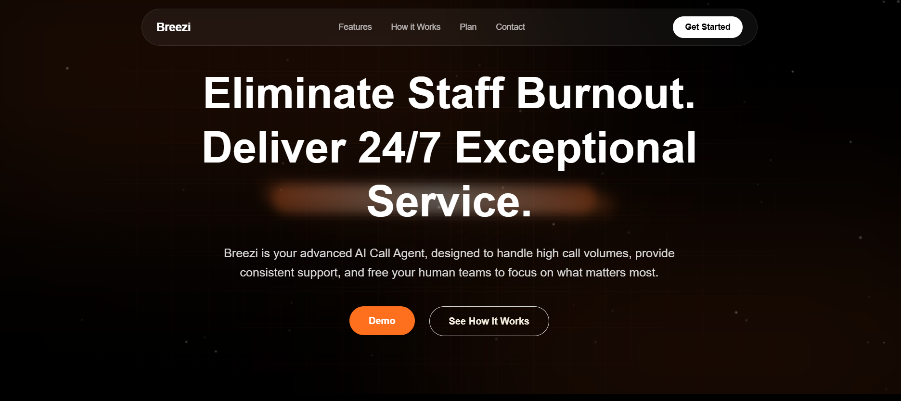
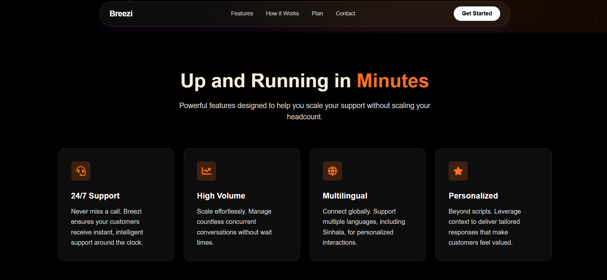

# inbreezi-website

https://inbreezi.com

---

## Overview
**Inbreezi** is the official marketing page for Breezi AI, an innovative AI-powered call handling solution that automates customer calls for businesses, providing instant responses, managing bookings, and delivering consistent support 24/7. Built with Next.js, the site is designed to showcase Breezi’s features in a clear and engaging way, with sections highlighting its capabilities, a smooth user experience, and responsive design for all devices. It serves as a professional landing page to introduce the product, educate visitors, and encourage them to explore or try Breezi AI.

## Website Demo

[Website Demo Video](screenshots/demo.mp4)

---

## Features
- Fully responsive design (mobile, tablet, desktop)  
- Interactive user dashboard   
- SEO-friendly pages for better discoverability  
- Fast performance and smooth user experience  

---

## Technologies
- **Frontend:** Next.js, JavaScript, HTML5, CSS3  
- **Hosting:** Vercel  

---

## Screenshots
Below are selected highlights of the Inbreezi website interface.

### Hero Section

### Features Section

### Contact Section

📁 **View full screenshot collection:**  
[screenshots folder](screenshots)

This folder contains additional screenshots covering all pages, components, and responsive layouts.

---

## Developers / Credits
- **[Shane Uduwaka](https://github.com/ShaneUduwaka)** – Frontend development, Next.js implementation, UI/UX  
- **[Tevin Bandara](https://github.com/Tevin-gg)** – Feature development, design, and testing  

> Source code is **private** due to commercial use. This repository serves as a professional portfolio showcase.

---

## Explore the Website
Visit the **[Live Website](https://inbreezi.com)** to see full functionality.  
This repository contains screenshots and documentation highlighting key features.

---

## Notes
- Updated regularly to reflect new features  
